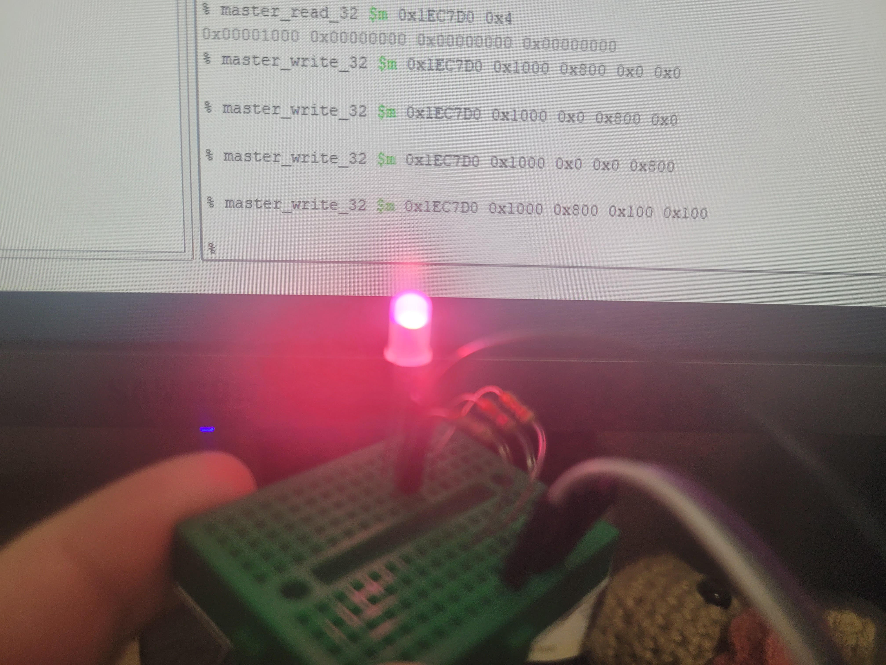

# Hw 10: RGB LED Controller VHDL

# Overview
In this assignment, we created an RGB LED controller using the PWM controller we created in HW 8.

## Deliverables
### Current limiting resistances
Red: $\frac{3.3-2}{20mA}=65\Omega$

Green: $\frac{3.3-3}{20mA}=15\Omega$

Blue: $\frac{3.3-3}{20mA}=15\Omega$

### Images with commands and LED
Red LED with command `master_write_32 $m 0x1EC67D0 0x1000 0x800 0x0 0x0`
<red>

Green LED with command `master_write_32 $m 0x1EC67D0 0x1000 0x0 0x800 0x0`
<green>

Blue LED with command `master_write_32 $m 0x1EC67D0 0x1000 0x0 0x0 0x800`
<blue>

Pink LED with command `master_write_32 $m 0x1EC67D0 0x1000 0x800 0x100 0x100`
<pink>