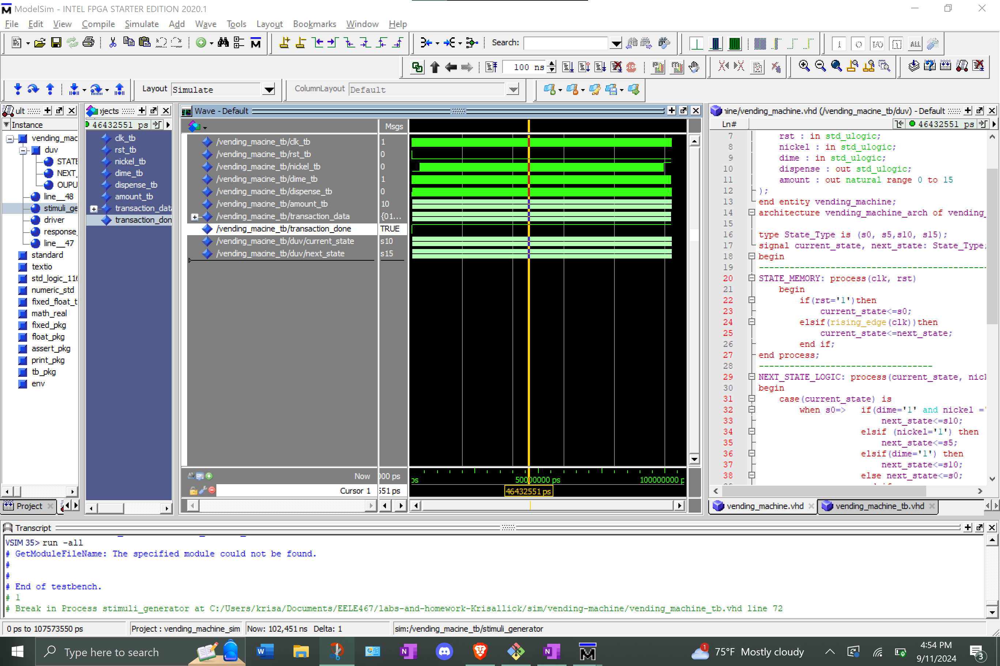

# Homework 4: Timed Counter
## Overview
For this homework we created a timed counter. When given a count time this Timed Counter will count up to the time divided by the FPGA clock period
## Deliverables
<Screenshot>