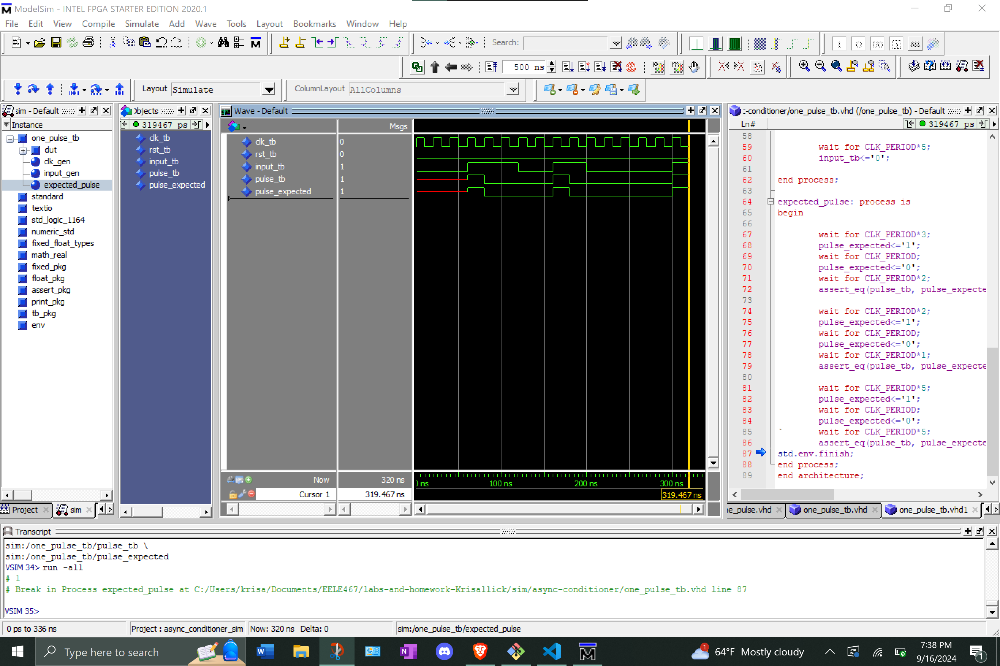

# Homework 6 Async Conditioner
## Overview
For this assignment we created a debouncer and a one pulse component. Both components were also simulated to assure they worked as intended. Once created and simulated, these components, and our previously made synchronizer component, were declared within our async_conditioner vhd file.
## Deliverables
### Debouncer Simulation Screenshot
<Screenshot1>

### One Pulse Simulation Screenshot

<Screenshot2>