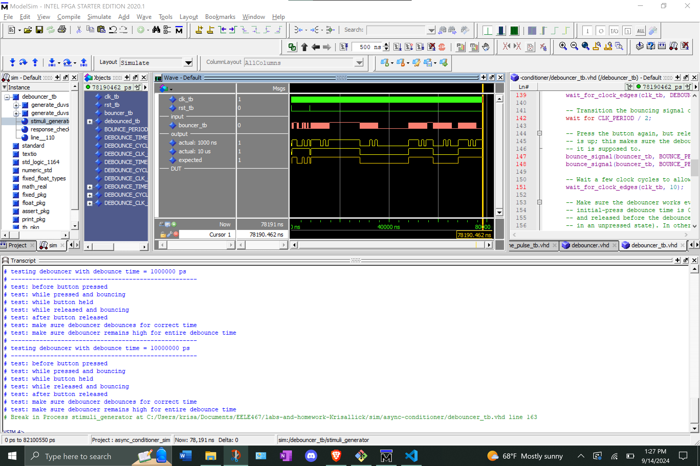

# Homework 6 Async Conditioner
## Overview
For this assignment we created a debouncer and a one pulse component. Both components were also simulated to assure they worked as intended. Once created and simulated, these components, and our previously made synchronizer component, were declared within our async_conditioner vhd file.
## Deliverables
### Debouncer Simulation Screenshot
This screenshot shows the successful completion of the debouncer testbench.
<Screenshot1>

### One Pulse Simulation Screenshot
This screenshot shows the one pulse output for three different lengths of input being held high.

<Screenshot2>

### Async conditioner Simulation Screenshot
This screenshot shows two button presses with the output only sending a single pulse after the initial input goes through the components.

<Screenshot3>