# Hw 7: Linux CLI Practice

# Overview
In this assignment we practiced a multitude of linux commands.

# Deliverables
### Question 1, 2, and 3
`wc -w -m -l lorem_ipsum.txt` for all three at once, and the following commands are the exact same just seperated out to show they are the same. 
<reg>

### Question 4
`sort -h file-sized.txt`

<reg>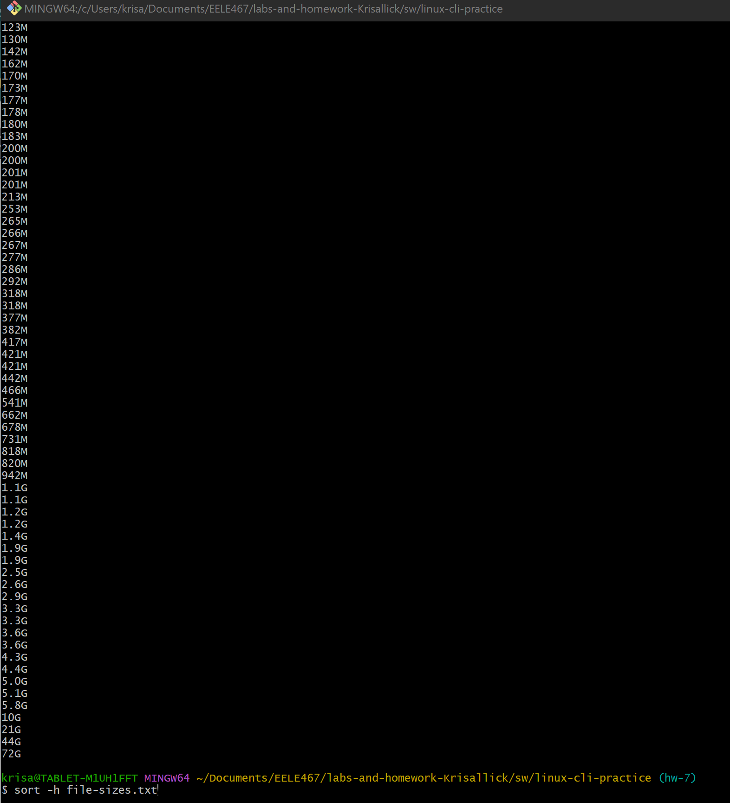

### Question 5
`sort -h -r file-sizes.txt`
<reg>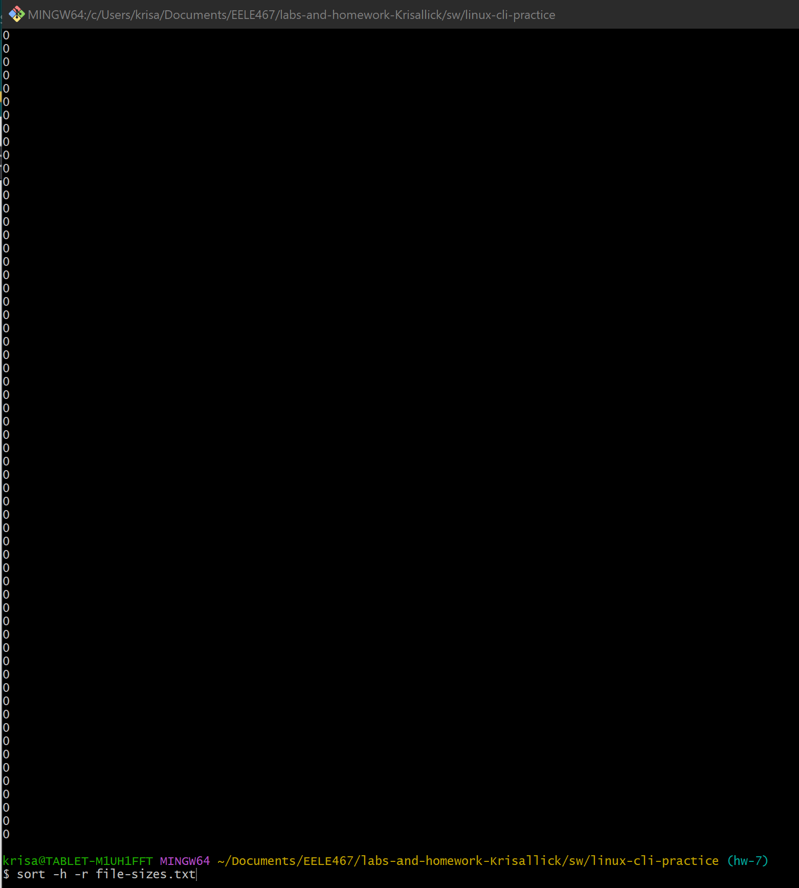

### Question 6
`cut -d','-f3 log.csv`
<reg>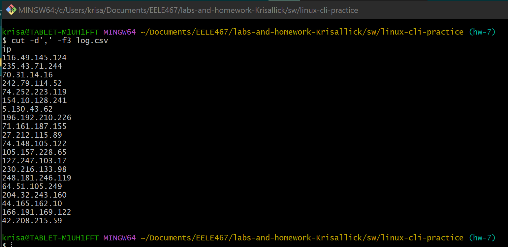

### Question 7
`cut -d','-f2,3 log.csv`
<reg>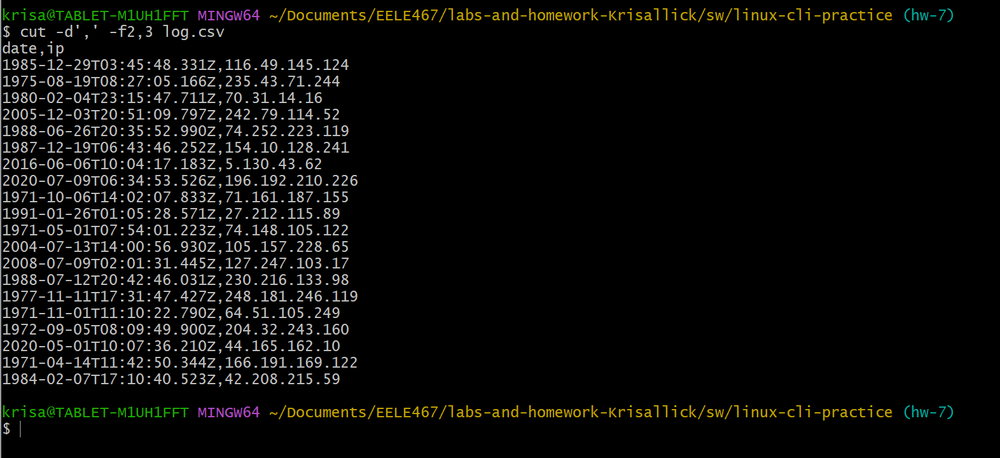

### Question 8
`cut -d','-f1,4 log.csv`
<reg>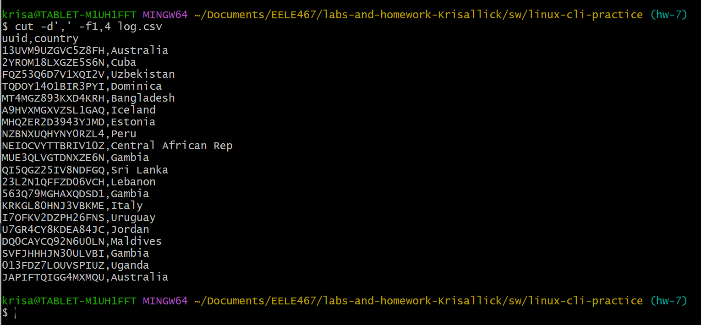

### Question 9 and 10
`head -3 gibberish.txt` and `tail -3 gibberish.txt`
<reg>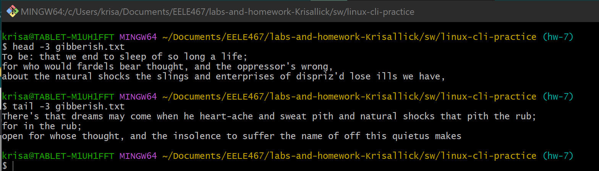

### Question 11
`tail -n20 log.csv`
<reg>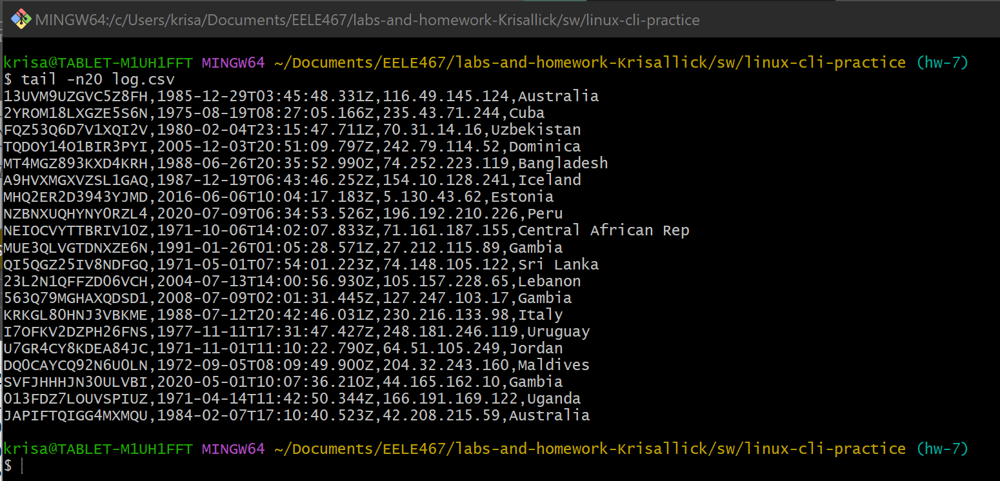

### Question 12
`grep -c and gibberish.txt`
<reg>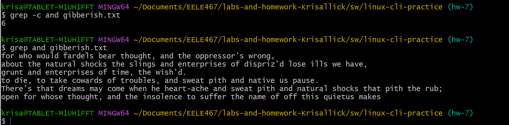

### Question 13
`grep -w we gibberish.txt`
<reg>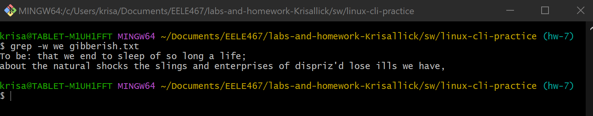

### Question 14
`grep -i -o -P 'to.\w+' gibberish.txt`
<reg>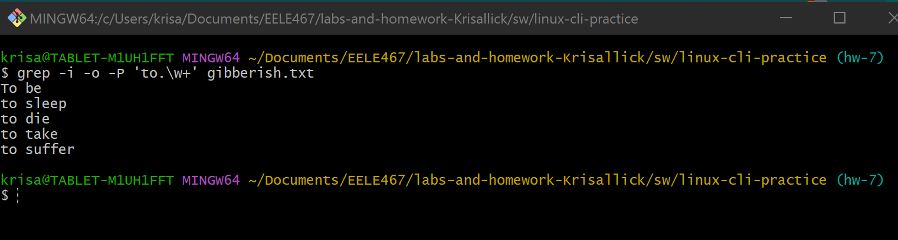

### Question 15
`grep -c FPGAs fpgas.txt`
<reg>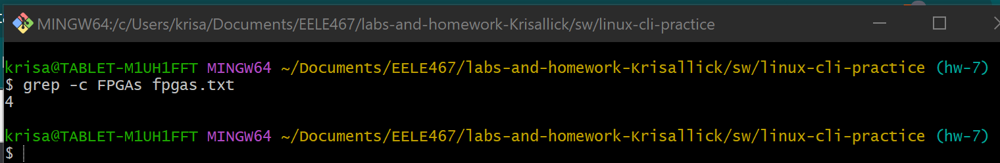

### Question 16
`grep -P '.(ot)|.(ower)|.(mile)' fpgas.txt`
<reg>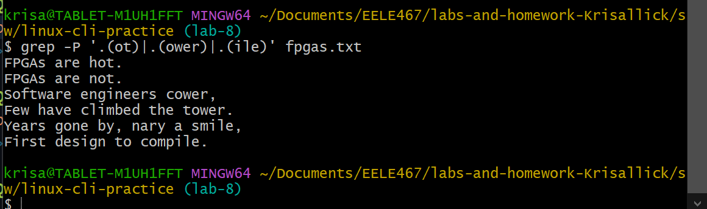

### Question 17
`grep -r -c --include=\*.vhd "^[^/]*--.*$`
<reg>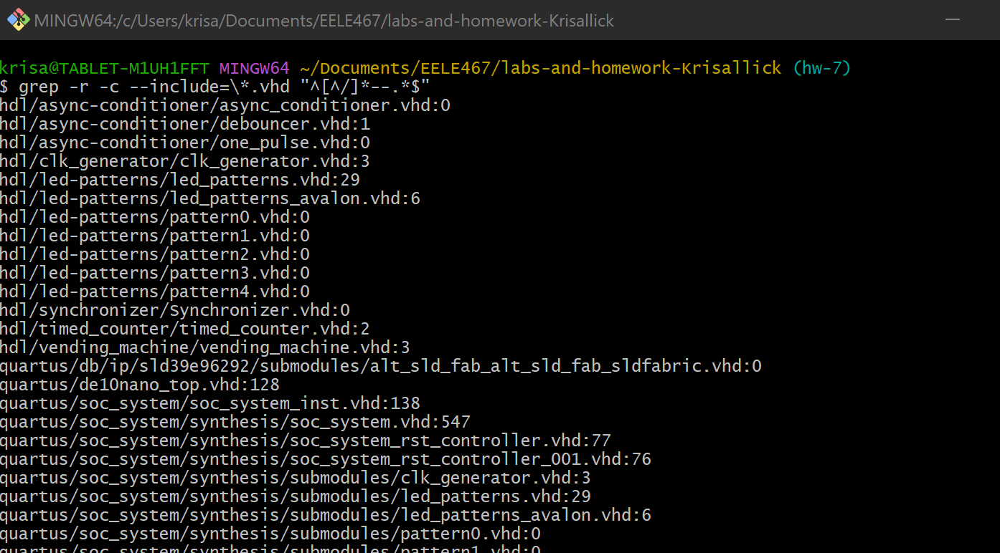

### Question 18
`ls > output.txt` then `cat output.txt` because it wouldn't work to pipe them together.
<reg>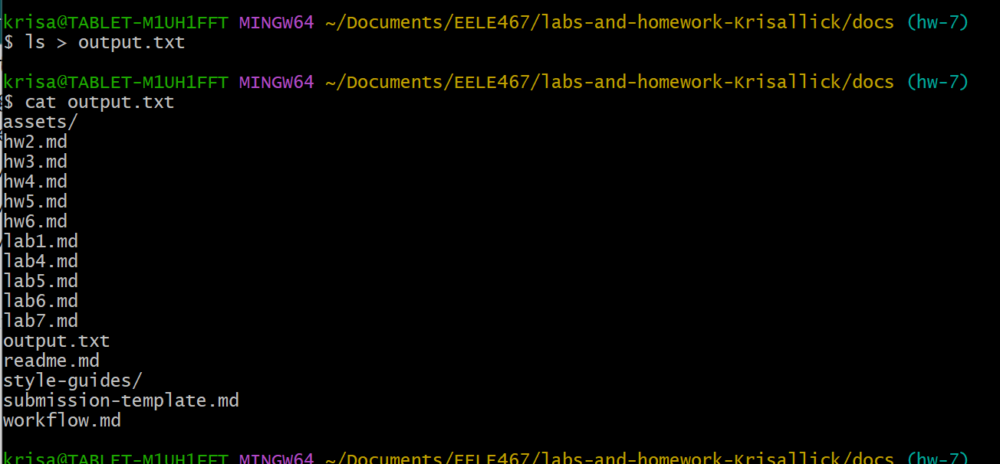

### Question 19
`sudo dmesg|grep"CPU"` because nothing had "topo" within it.
<reg>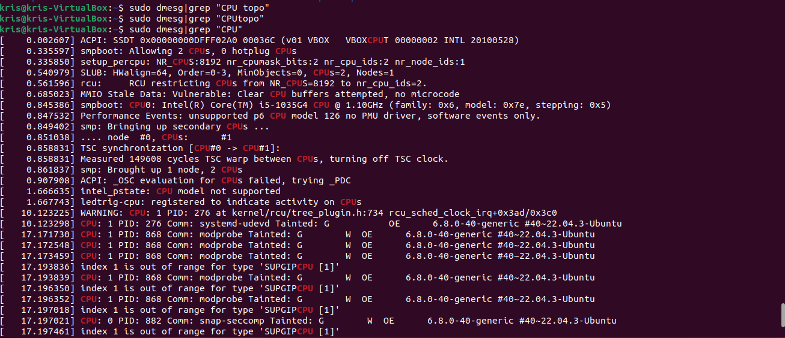

### Question 20
`find hdl -iname '*.vhd' | wc`
<reg>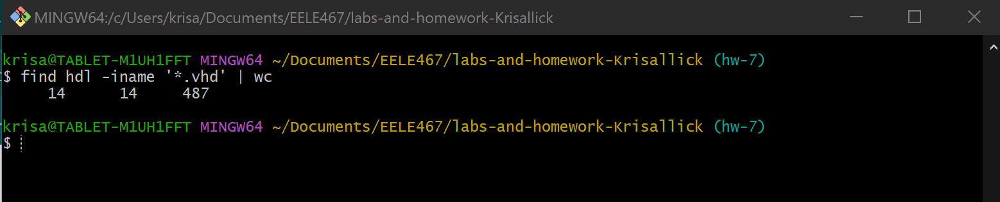

### Question 21
`find hdl -iname '*.vhd' |grep -r -c --include =\*.vhd "^[^/]*--.*$"`
<reg>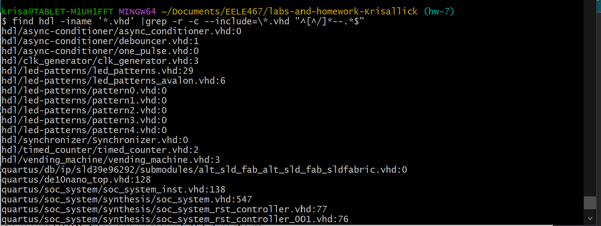

### Question 22
`grep -n "FPGAs" fpgas.txt`
<reg>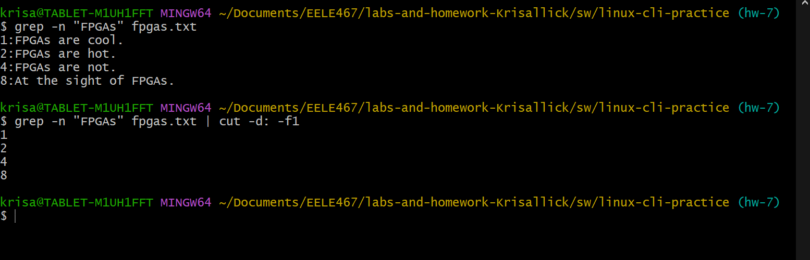

### Question 23
`du -h*|sort -hr | head -n3`
<reg>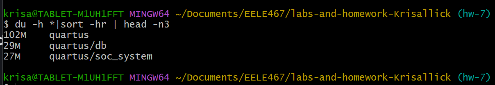

