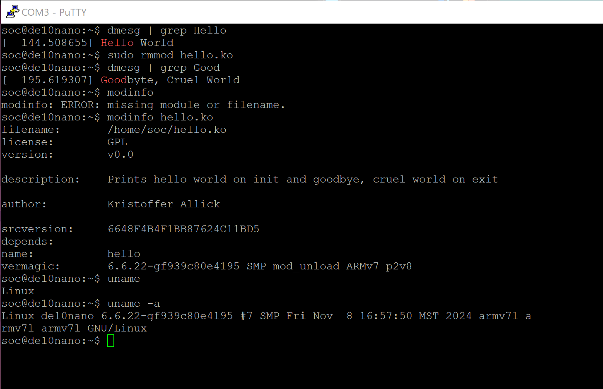

# "Hello World" Linux Kernel Module
## Overview
The objective of this homework was to create a kernel that was cross compiled for the soc FPGA. Then load our own kernel module and run it in the FPGA kernel we just made.
# Deliverables
This screenshot shows all three deliverables: the dmesg messages from my own kernel module, the modinfo of my module, and the info of my system via uname.
<screenshot>
