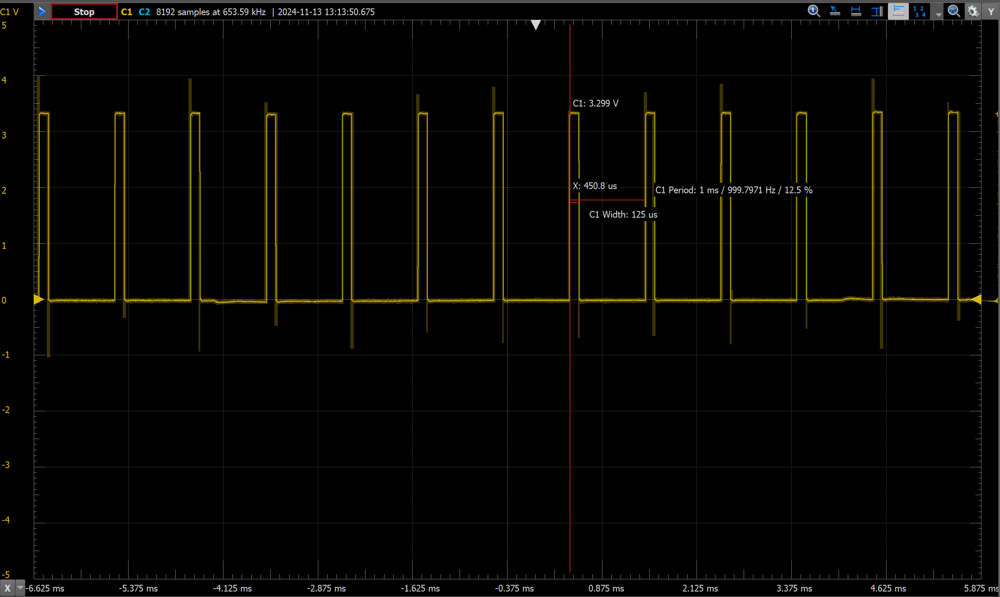

# Hw 9: PWM Controller

# Overview
In this assignment we created a PWM controller in hardware.We also simulated, and tested to ensure it works as intended.

# Deliverables
Below are screenshots of a few simulated waveforms and the actual oscilloscope waveform.

### 100% duty cycle
<screen1>

### 50% duty cycle
<screen2>

### 12.5% duty cycle
<screen3>

### 12.5% duty cycle on oscilloscope
<screen4>