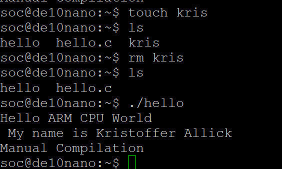

# Lab 3: Developer's Setup
## Overview 
For this lab we set up both a TFTP and a NFS server connection via our ethernet from our computer to our FPGA.
## Deliverables
Here is the screenshot of both the ability to create a file via PuTTY and my hello executable running.
<screenshot>