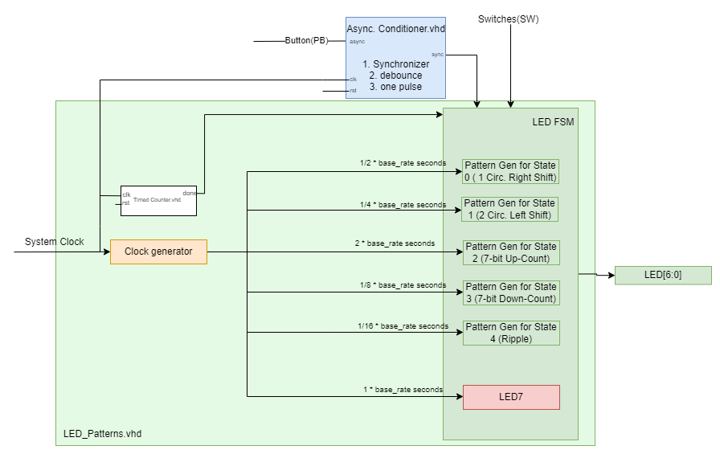

# Project Overview
The objective of this lab was to create a project that shows five different LED patterns depending on switches, then implement that into the FPGA hardware.
## Functional Requirements
Firstly, an implementation of the HPS_LED signal had to be created, this signal dictates whether the LEDs are controlled by software or by the finite state machine on the FPGA. While the LEDs are controlled by the finite state machine they must follow these requirements: the seventh LED must always blink at a rate of 1 * base_rate seconds, there must be five states that show a different pattern on the rest of the LEDs for each state, and state transitions will be dictated by a push button. The five patterns are: one lit LED will shift right circularly at 1/2 * base_rate seconds, two lit LEDs will shift left circularly at 1/4 * base_rate seconds, the output of a wrapping 7-bit up counter at 2 * base_rate seconds, the output of a wrapping 7-bit down counter at 1/8 * base_rate seconds, and a custom pattern which in this case is a ripple effect at 1/16 * base_rate seconds. The transitions must work as such: when the button is pressed the state of the switches will display on the LEDs instead of any of the patterns, then the state will change to what the switches were set to, if the switches are a binary value of five or more the state will stay in the previous pattern state, the finite state machine will then stay in that pattern state until the button is pushed again. 
## System Architecture
### Component Structure and Block Diagram
The architecture for this system is relatively simple. The top.vhd file holds two components, LED_patterns.vhd and Async_conditioner. The Async_conditioner simply conditions the push button on the FPGA so it is synchronous and debounced, even though it is already debounced in hardware. Going a layer deeper, the LED_patterns.vhd holds the Clock_generator.vhd component, timed_counter.vhd component, and all five patterns have been created as components and are held within LED_patterns.vhd as well. The clock generator takes in two important signals along with reset, it takes in cnt and clk. clk is self-explanatory but cnt is an unsigned value that is the base rate input required for our LED_patterns.vhd adjusted to be an unsigned to be used for counters within the component. From there the clock generator takes in that unsigned value and outputs the five different base rates to use for the patterns. From there each pattern component takes in the respective base rate as its clock input. On the rising edge of that "clock" it does a different process depending on the pattern, then sends a std_logic_vector out of the output signal line which, in turn, is connected to the LEDs.

<BlockDiagram>

### State Machine
The state machine for this system can be set up a couple of different ways. My state machine can be seen below, essentially no matter which state you are in stays in the current state unless the button is pressed. Once the button is pressed the state machine moves to the display state. The display state will show the state of the switches for one second, using the timed counter. Once the done signal from the timed counter is set high the switches will be read and the state will change to the selected state. Within each one of the states the related pattern component output is sent out to the LEDs. 

<StateMachine>

## Implementation Details of Custom Pattern
For my custom LED pattern I decided to do a ripple pattern at a rate of 1/16 * base_rate. This starts with the center LED lit, then after 1/16 * base_rate it will split into two LEDs in each direction. After that, the two lit LEDs will move outwards every 1/16 * base_rate until no LEDs are available, then reset and repeat.

