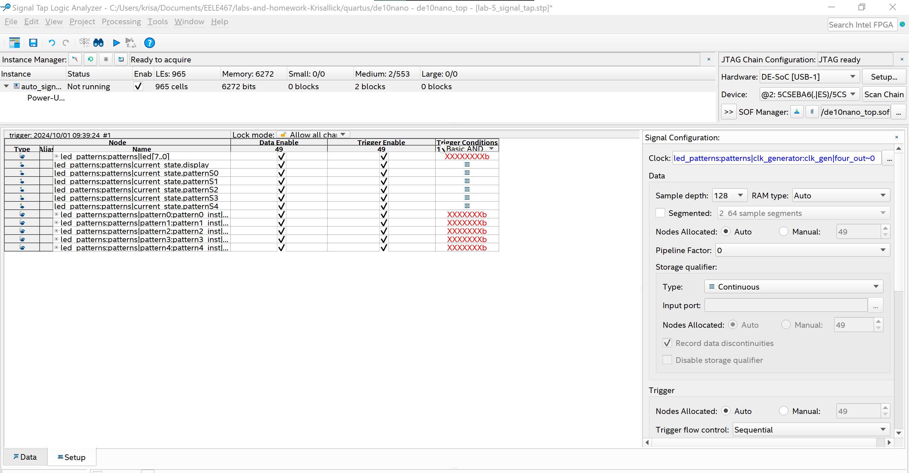
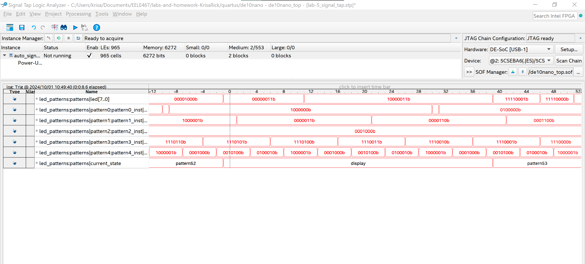

# Overview
In this lab we looked at internal signals of our LED_patterns from lab 4 using the signal tap logic analyzer tool.
# Deliverables
<configuration>

<waveforms>

# Questions
6272 bits were required to monitor my signals.
