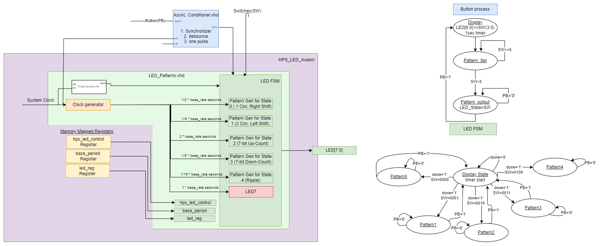

# Overview
The objective of this lab was to create a new component using platform designer and integrate it into our soc system. 
# System Architecture
With the new led_avalon component there are now registers that can be accessed for read and write to control the led_patterns through other methods. The led_avalon component instantiates the led_patterns and currently is running it specifically through the state machine so nothing fundamentally has changed from lab 4 until now. Below is an updated block diagram with the avalon wrapper and the registers.

<BlockDiagram>

# Register Map
Here are images of the three registers that have been created, currently nothing has been dedicated to many of the bits within these register as we have not talked about that yet. However, default values of 0 have been given to all except base rate, which was given a default value of 00010000.
## Registers
hps_led_control at h00
<reg>
base_period at h01
<reg>
led at h10
<reg>

# Platform Designer
    1. The registers are connected through the soc_system via the platform designer.
    2. The base address of my component is h00.